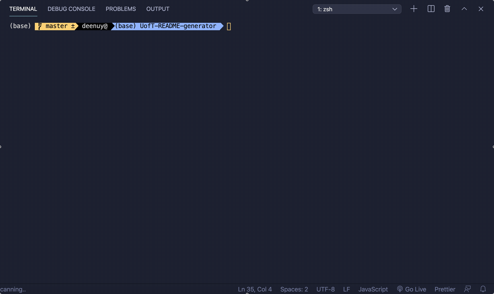

# Title: 

README generator

## Description: 

README.md file generator for github node platform projects

## Website: 

https://deenuy.github.io/UofT-README-generator/demo-readme.gif

## Table of Contents:
* [Description](#Description)
* [Installation](#IInstallation)
* [License](#License)

## Installation & Usage: 
Execute following from mac terminal or windows git bash:
* `npm install`
* `node index.js`

## Demo

## License:

